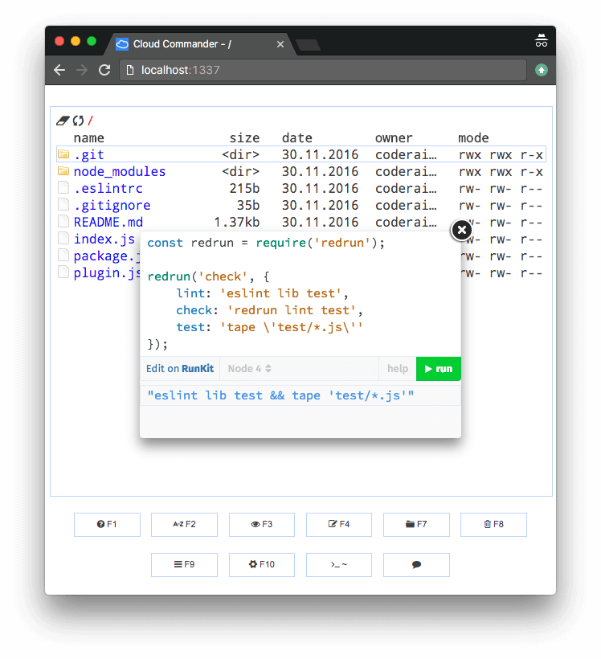

# Cloud Commander Plugin



If you ever dreamed about having ability to expose functionality of `Cloud Commander`, now your dreames came true:
with help of `plugins` field in `options` you can use specify client-side js files, that will be loaded strict after load of `Cloud Commander`.

```js
app.use(cloudcmd({
    plugins: [
        __dirname + '/' + 'plugin.js'
    ]
}));
```

On a client we going to embed [RunKit](https://runkit.com/docs/embed "RunKit").
Next code loads necessary files, viewer and embed `RunKit` to viewer.
Let's take a look at `plugin.js`.

```js
'use strict';

const element = document.createElement('div');

exec.series([
    loadRunKit,
    notebook,
    CloudCmd.View,
    init,
]);

function loadRunKit(fn) {
    load.js('https://embed.runkit.com', fn);
}

function notebook(fn) {
    fn();
    RunKit.createNotebook({
        element,
        source: 'js source'
    });
}

function init() {
    CloudCmd.View.show(element, {
        autoSize: true
    });
}
}
```

